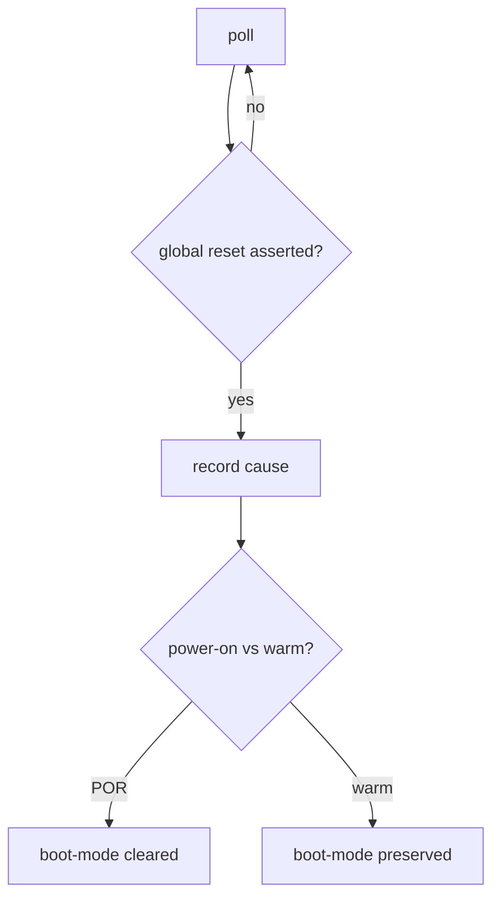

# CRU Reset Ladder

> **Outcome tested:** Reset cause is attributable and the boot-mode register survives a warm reset.

**Benchmark** (`cru_poll`): 21.4 ns/op

```mermaid
flowchart TD
  A[poll] --> B{global reset asserted?}
  B -- no --> A
  B -- yes --> C[record cause]
  C --> D{power-on vs warm?}
  D -- POR --> E[boot-mode cleared]
  D -- warm --> F[boot-mode preserved]
```
