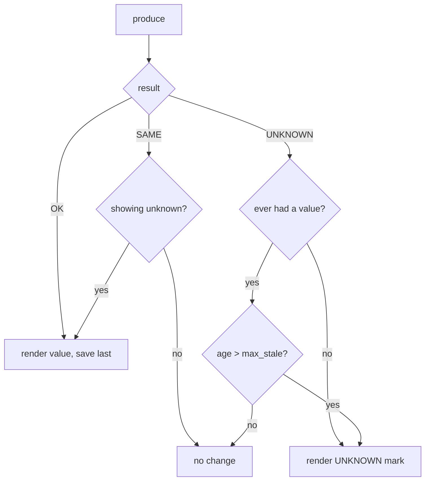

# UI Freshness Contract

> **Outcome tested:** The UI never shows a stale number: it holds briefly, then marks unknown.

**Coverage**: freshness.c: 66/66 conditions, 100% MC/DC (CI-enforced)

```mermaid
flowchart TD
  A[produce] --> B{result}
  B -- OK --> V[render value, save last]
  B -- SAME --> C{showing unknown?}
  C -- yes --> V
  C -- no --> N[no change]
  B -- UNKNOWN --> D{ever had a value?}
  D -- no --> U[render UNKNOWN mark]
  D -- yes --> E{age > max_stale?}
  E -- yes --> U
  E -- no --> N
```
