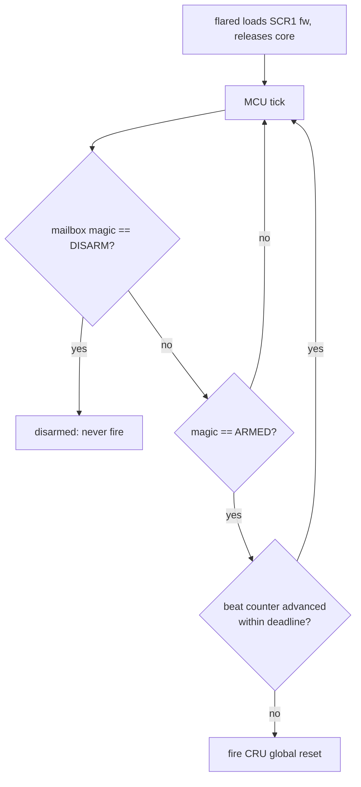

# HPMCU Watchdog

> **Outcome tested:** A hung A7/flared ends in a counted reset, not a dark panel.

**Benchmark** (`hpmcu_tick`): 1.8 ns/op

```mermaid
flowchart TD
  A[flared loads SCR1 fw, releases core] --> B[MCU tick]
  B --> C{mailbox magic == DISARM?}
  C -- yes --> D[disarmed: never fire]
  C -- no --> E{magic == ARMED?}
  E -- no --> B
  E -- yes --> F{beat counter advanced\nwithin deadline?}
  F -- yes --> B
  F -- no --> G[fire CRU global reset]
```
