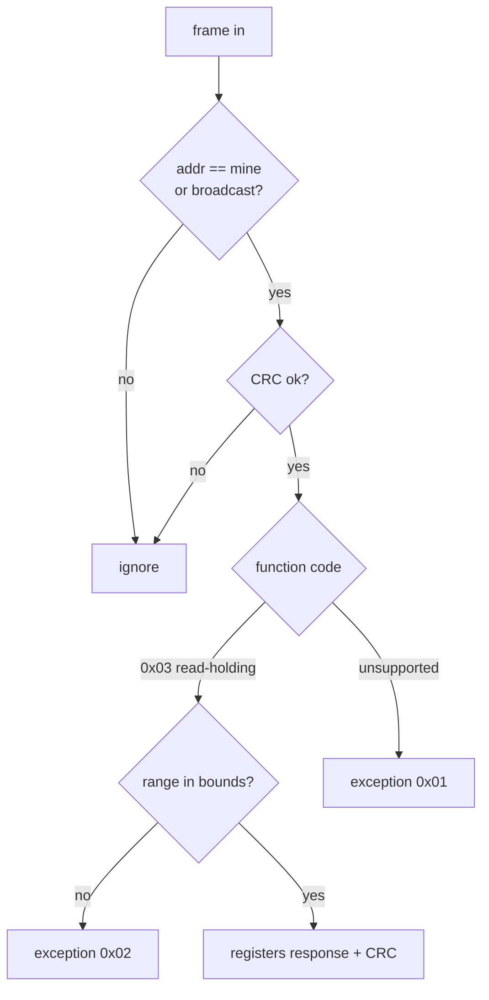

# Modbus RTU: read-holding-registers round trip

> **Outcome tested:** A well-formed request yields the right registers; a bad one a defined fault.

**Benchmark** (`modbus_read_holding`): 88.0 ns/op

