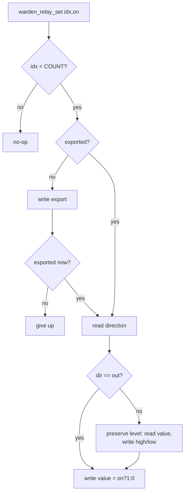

# Relay Drive

> **Outcome tested:** A relay is exported transparently and driven without disturbing a held contact.

**Coverage**: relays.c: 40/40 conditions, 100% MC/DC (CI-enforced)

```mermaid
flowchart TD
  A[warden_relay_set idx,on] --> B{idx < COUNT?}
  B -- no --> Z[no-op]
  B -- yes --> C{exported?}
  C -- no --> D[write export] --> E{exported now?}
  E -- no --> Z2[give up]
  E -- yes --> F
  C -- yes --> F[read direction]
  F --> G{dir == out?}
  G -- no --> H[preserve level: read value,\nwrite high/low]
  G -- yes --> I
  H --> I[write value = on?1:0]
```
